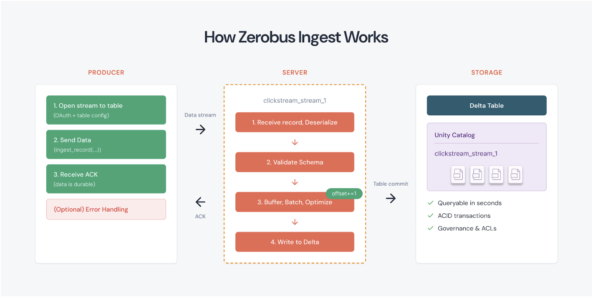
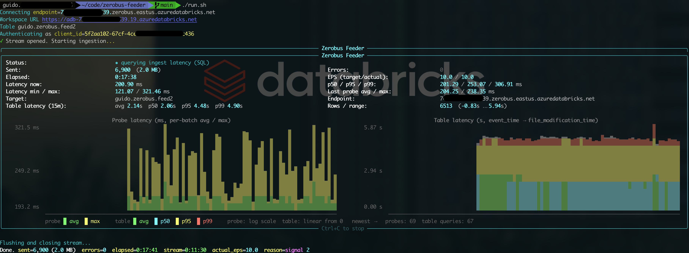

# zerobus-feeder

Configurable Python client that streams synthetic data into a Databricks
[Zerobus](https://docs.databricks.com/aws/en/ingestion/zerobus-overview) endpoint.
Useful for load-testing, demos, and smoke-testing Zerobus integrations.



Features:

- CLI flags, YAML config file, or interactive wizard (your last entries are
  remembered and prefilled).
- Random-data generator driven by a simple JSON schema (strings, ints, longs,
  floats, doubles, booleans, timestamps, dates, binary, choice lists, nullable
  columns).
- Optional helpers that create the target Delta table and the service principal
  (plus OAuth secret and grants) via a Databricks CLI profile.
- Live terminal dashboard with throughput, latency percentiles, and a sparkline
  of recent latencies.
- OAuth2 client-credentials authentication via the Zerobus Python SDK — no PAT
  on disk.

## Prerequisites

- Python 3.9+
- A Databricks workspace in a Zerobus-supported region (AWS, Azure, or GCP)
- Target table as a **managed** Delta table in Unity Catalog (the script can
  create it for you with `--create-table`)
- A service principal with OAuth2 client-credentials and `USE CATALOG`,
  `USE SCHEMA`, `MODIFY`, `SELECT` on the target table (the script can create
  and grant with `--create-sp` / `--create-table`)
- Databricks CLI configured (`~/.databrickscfg`) if you want to use
  `--create-sp` / `--create-table` or auto-prefill `workspace_url` /
  `workspace_id`

## Installation

### Option A: startup scripts (recommended)

The `run.sh` (Linux / macOS) and `run.bat` (Windows) wrappers create a local
virtualenv on first launch, install dependencies, and then forward all
arguments to `zerobus_feeder.py`:

```bash
# Linux / macOS
git clone https://github.com/guidooswaldDB/zerobus-feeder.git
cd zerobus-feeder
./run.sh
```

```bat
REM Windows
git clone https://github.com/guidooswaldDB/zerobus-feeder.git
cd zerobus-feeder
run.bat
```

Subsequent runs reuse the existing venv and skip reinstalling unless
`requirements.txt` has changed.

### Option B: manual

```bash
git clone https://github.com/guidooswaldDB/zerobus-feeder.git
cd zerobus-feeder
python3 -m venv .venv
source .venv/bin/activate           # Windows: .venv\Scripts\activate
pip install -r requirements.txt
```

## Quick start (first run)

On the first invocation there is no remembered state, so the script offers a
guided setup:

```bash
./run.sh                # or: run.bat   — or: python zerobus_feeder.py
```

The wizard will:

1. Let you pick a Databricks CLI profile from `~/.databrickscfg` and prefill
   `workspace_url` / `workspace_id` from it.
2. Optionally create a new service principal and OAuth secret.
3. Optionally create the target table (from the schema JSON) and apply grants.
4. Prompt for any remaining required fields and start streaming.

After the first run, values are written to `.zerobus_feeder_last.yaml` (already
listed in `.gitignore`) and prefilled next time.

## Configuration precedence

| Source | Notes |
|---|---|
| `--config <yaml>` | If passed, **all other CLI flags and remembered values are ignored**. |
| CLI flags | Override remembered values. |
| `.zerobus_feeder_last.yaml` | Remembered values from the previous run. |
| Interactive prompts | Fill anything still missing (unless `--non-interactive`). |

## CLI reference

```
python zerobus_feeder.py [options]

  --config, -c FILE         Path to YAML config file (overrides all other params)
  --eps FLOAT               Target events (records) per second
  --schema-file FILE        JSON file describing the data structure
  --workspace-id DIGITS     Used to build the Zerobus endpoint
  --region CODE             e.g. us-west-2, eastus
  --cloud {aws,azure,gcp}   Cloud provider
  --table-name NAME         Full table name (catalog.schema.table)
  --client-id ID            Service principal client ID
  --client-secret SECRET    Service principal client secret
  --workspace-url URL       https://<host>; auto-filled from CLI profile if set
  --profile NAME            Databricks CLI profile (for --create-sp/--create-table)
  --warehouse-id ID         SQL warehouse used by --create-table
  --sp-display-name NAME    Display name for --create-sp
  --create-sp               Create an SP + OAuth secret (needs --profile)
  --create-table            Create the target table from the schema (needs --profile)
  --no-table-latency        Skip the periodic ingest-latency SQL query
  --interactive             Force prompts for every parameter
  --non-interactive         Never prompt; error on any missing required parameter
```

Mandatory parameters: `eps`, `schema_file`, `workspace_id`, `region`, `cloud`,
`table_name`, `client_id`, `client_secret`, `workspace_url`. In
`--non-interactive` mode the script exits with code 2 and lists any missing
ones.

## YAML config

`sample_config.yaml` documents every parameter. When passed via `--config`, it
is the sole source of configuration:

```bash
python zerobus_feeder.py --config sample_config.yaml
```

## Data structure JSON

`sample_schema.json` shows the supported types and per-column options. The
schema drives both the randomly generated payloads and the `CREATE TABLE`
issued by `--create-table`.

| Type | Delta type | Options |
|---|---|---|
| `string` | `STRING` | `length` or `min_length`/`max_length`, `prefix`, `alphabet`, `choices` |
| `int` | `INT` | `min`, `max`, `choices` |
| `long` | `BIGINT` | `min`, `max`, `choices` |
| `float` | `FLOAT` | `min`, `max`, `precision` |
| `double` | `DOUBLE` | `min`, `max`, `precision` |
| `boolean` | `BOOLEAN` | `true_probability` |
| `timestamp` | `TIMESTAMP` | `offset_seconds`, `jitter_seconds` (emitted as Unix microseconds) |
| `date` | `DATE` | `offset_days`, `range_days` (emitted as epoch days) |
| `binary` | `BINARY` | `length` (base64-encoded in JSON) |

Every column also accepts `nullable: true` + `null_probability: 0.0..1.0`.

## Creating the service principal and table

```bash
python zerobus_feeder.py \
  --profile DEFAULT \
  --schema-file sample_schema.json \
  --table-name main.default.zerobus_feeder_events \
  --cloud aws --region us-west-2 --workspace-id 1234567890123456 \
  --create-sp --create-table --eps 50
```

This will:

1. Create a service principal named `zerobus-feeder` (override with
   `--sp-display-name`), generate an OAuth secret, and store the credentials in
   `.zerobus_feeder_last.yaml`.
2. Prompt for (or auto-pick) a SQL warehouse, issue
   `CREATE TABLE IF NOT EXISTS <table>`, then grant
   `USE CATALOG` / `USE SCHEMA` / `MODIFY` / `SELECT` to the SP.
3. Start the stream at 50 EPS with the live dashboard.

If the workspace-level OAuth secret API isn't available, the script prints a
link to the Databricks UI so you can generate the secret manually, then rerun
with `--client-id` / `--client-secret`.

## Non-interactive / automated runs

After a first successful run, you can reproduce the stream from remembered
state:

```bash
python zerobus_feeder.py --non-interactive
```

Or from a YAML file (ideal for CI / ephemeral VMs):

```bash
python zerobus_feeder.py --config /path/to/config.yaml
```

## Live dashboard

While running, the terminal shows:

- Target vs. actual EPS (events per second), total sent, errors, elapsed time
- Current / min / max / p50 / p95 / p99 SDK round-trip latency (ms)
- Unicode-block sparkline of recent per-record latencies
- End-to-end ingest latency (event_time → file_modification_time) over the
  last 15 minutes, sampled via a SQL query against the target table after
  every probe batch — disable with `--no-table-latency`
- Target table, Zerobus endpoint, workspace URL



Press `Ctrl+C` to flush and close the stream cleanly; a final summary is
printed.

### Ingest-latency query

When a `profile` and `warehouse_id` are configured (or `warehouse_id` is
selected at startup when missing), the feeder executes this query once per
probe cycle on the same SQL warehouse:

```sql
SELECT
  count(*)                                                                              AS total_rows,
  round(avg(unix_timestamp(_metadata.file_modification_time) - unix_timestamp(event_time)), 2) AS avg_latency_sec,
  min(unix_timestamp(_metadata.file_modification_time)   - unix_timestamp(event_time))  AS min_latency_sec,
  max(unix_timestamp(_metadata.file_modification_time)   - unix_timestamp(event_time))  AS max_latency_sec,
  percentile_approx(unix_timestamp(_metadata.file_modification_time) - unix_timestamp(event_time), 0.5)  AS p50_latency_sec,
  percentile_approx(unix_timestamp(_metadata.file_modification_time) - unix_timestamp(event_time), 0.95) AS p95_latency_sec,
  percentile_approx(unix_timestamp(_metadata.file_modification_time) - unix_timestamp(event_time), 0.99) AS p99_latency_sec
FROM <catalog>.<schema>.<table>
WHERE event_time >= current_timestamp() - INTERVAL 15 MINUTES;
```

The query is bounded by a 15s warehouse-side timeout, so a cold warehouse
cannot stall streaming. Pass `--no-table-latency` to skip it entirely.

## Authentication

Zerobus is authenticated via **OAuth2 client-credentials (M2M)** using a
Databricks service principal. `client_id` and `client_secret` are passed to the
Zerobus SDK, which handles token acquisition and refresh. The Databricks CLI
profile is only consulted for the optional `--create-sp` / `--create-table`
helpers and to prefill `workspace_url` / `workspace_id`.

## Files

| File | Purpose |
|---|---|
| `zerobus_feeder.py` | The script |
| `run.sh` | Startup wrapper for Linux / macOS (creates venv, installs deps, runs the script) |
| `run.bat` | Startup wrapper for Windows (same behaviour as `run.sh`) |
| `sample_schema.json` | Example data-structure definition |
| `sample_config.yaml` | Example YAML config |
| `requirements.txt` | Python dependencies |
| `.gitignore` | Excludes the last-values file, log file, venvs, caches |
| `.zerobus_feeder_last.yaml` | Auto-generated, local-only, stores last-used values **including the client secret** — never commit this |
| `zerobus_feeder.log` | Auto-generated, local-only, detailed per-session log (config resolution, SP/table creation, DDL, periodic latency snapshots, errors). Appended across runs. Never commit this |

## Troubleshooting

- **`Authentication failed` / `error 4024`**: the SP is missing explicit
  table-level `MODIFY` / `SELECT`. Schema-level inherited grants aren't
  sufficient for the Zerobus `authorization_details` flow.
- **`Connection refused` / DNS errors**: verify `cloud` and `region` match the
  workspace; the endpoint is built as
  `<workspace_id>.zerobus.<region>.<cloud-suffix>`.
- **Actual EPS well below target**: latency dominates at the single-stream
  throughput limit (100 MB/s, 15 k rows/s). Run multiple instances or lower the
  per-record payload.
- **First-run wizard doesn't appear**: it triggers only when
  `.zerobus_feeder_last.yaml` is absent and `--config` / `--non-interactive`
  aren't set. Delete the file to reset.

DISCLAIMER: This application and accompanying source code are provided solely for demonstration and proof-of-concept purposes. They are not intended for production use. Databricks, Inc. makes no warranties, express or implied, regarding the functionality, completeness, reliability, or suitability of this software. Databricks assumes no liability for any damages, data loss, or other issues arising from the use of this demonstration material. Any deployment to production environments is the sole responsibility of the implementing party.
